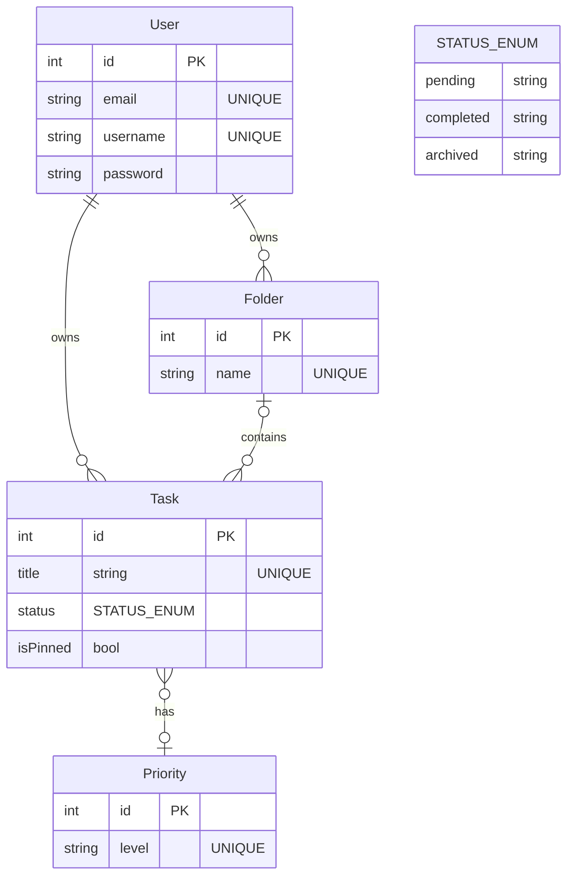

# Ma réponse dans cette partie du cahier des charges Readme.md 
# Documenter le déploiement	Rédigez un Readme qui explique comment lancer l'application à partir d'un serveur ou d'un PC neuf

alors comment j'ouvre un projet quand je suis sur un nouvel ordinateur ?

Voir documentation symfony
https://symfony.com/doc/current/deployment.html

Tu  as trouvé un emploi, tu arrives dans ta nouvelle entreprise, tu dois trouver le projet Symfony travaillé en cours sur ton ordinateur comment tu fais ?

Je demande par email ou par un équivalent comment se nomme le projet Symphony. Je lis leurs notes concernant le projet Symfony. Ensuite,imaginons que j'ai le nom du projet nommé "Test-Project-MSD" et l'os est Ubuntu Linux. J'ouvre un terminal. Je fais "sudo apt install plocate" puis "locate Test-Project-MSD". Si je ne trouve rien. Je fais cette commande "sudo updatedb" puis "locate Test-Project-MSD "qui affiche "/home/user/Bureau/Test-Project-MSD". Je fais "cd /home/user/Bureau/Test-Project-MSD" pour entrer dans le dossier. J'ouvre avec Visual Studio Code, le projet en question. Je vérifie s'il y a composer avec "composer -v". Si je n'ai pas de réponse, je fais "sudo composer install". Je refais "composer -v". Si j'ai ces lignes qui s'affichent :" Composer version 2.9.5 2026-01-29 11:40:53". Cela  veut dire que composer est installé. Je fais "php -v" (php -vPHP 8.5.5 (cli) (built: Apr 11 2026 06:53:07))pour connaître la version php et je fais une mise à jour ci-besoin.Je fais "symfony check:requirements" pour savoir si l'ordinateur est prêt à run des projets Symfony ou non. S'il est installé, je fais "symfony -V" pour connaître sa version (Symfony CLI version 5.15.1 (c) 2021-2026 Fabien Potencier (2025-10-04T08:05:57Z - stable)) et je fais une mise à jour ci-besoin. J'échange avec mes collègues pour rejoindre le bon repository Github. Je fais "symfony help" car je ne souviens pas de toutes les commandes par coeur. J'installe les dépendances manquantes. Je vérifie le".env". Enfin, je fais "symfony server:start" pour lancer le serveur dans le navigateur et commencer à travailler. Je quitte le serveur symfony en faisant "symfony server:stop".

Pour conclure, j'effectue les étapes et lignes de commandes dans cet ordre :
                -échanges avec équipe pour connaître le projet en général et son nom "Test-Project-MSD"
                -ctrl + alt +t
                -sudo apt install plocate
                -locate Test-Project-MSD
                -sudo updatedb
                -locate Test-Project-MSD affiche /home/user/Bureau/Test-Project-MSD
                -cd /home/user/Bureau/Test-Project-MSD
                -ouvrir le projet via Visual Studio Code
                -composer -v
                -sudo composer install
                -composer -v affiche Composer version 2.9.5 2026-01-29 11:40:53
                -php -v
                -symfony check:requirements
                -symfony -V affiche (Symfony CLI version 5.15.1 (c) 2021-2026 Fabien Potencier (2025-10-04T08:05:57Z - stable))
                -échanges avec collègues pour rejoindre le bon repository Github
                -symfony help
                -installer les dépendances manquantes
                -vérifier le .env
                -symfony server:start
                -travailler sur le projet
                -symfony server:stop
  

# Cahier des charges ci-dessous

# phase3-symfony-tasklist-reloaded
Une application de gestion de tâches priorisées et organisées en dossiers. Développée avec Symfony.

# Projet TaskList Reloaded
Le bon vieux Tasklist, c'est le projet CRUD classique idéal pour faire un tour d'horizon de Symfony. :)

*Have fun and don't forget to `symfony console cache:clear`*

> Ici se trouve le cahier des charges fonctionnel et une partie du cahier des charges non fonctionnel (le schéma de la base de données).

## Objectif pédagogique : le CRUD, les relations SQL simples et l'authentification.

## Critères d'évaluation :
|Critères|Description|
|-|-|
|MVP|Epic 1 : Gestion des tâches |
|Respect de la maquette |
|   Implémentation du diagramme UML pour la BDD|
| Authorization | Routes privées et publiques|
| Readme.md Documenter le déploiement | Rédigez un Readme qui explique comment lancer l'application à partir d'un serveur ou d'un PC neuf |
|V2 (bonus) | Epic 2 : Organisation & Tri |

## Cahier des charges fonctionnel

### Synopsis
Une application de gestion de tâches priorisées et organisées en dossiers. Développée avec Symfony.

### Maquette

Maquette interactive :
https://www.figma.com/proto/O1CFvazkgkjUsdGpVpozRj/Untitled?node-id=4-823&t=S5RtpiUl6nNUacow-1&scaling=min-zoom&content-scaling=fixed&page-id=0%3A1&starting-point-node-id=4%3A823&show-proto-sidebar=1

### Epic 1 : Gestion des tâches

- User Story 1 : En tant qu'utilisateur, je veux créer une tâche avec un titre et une priorité afin d'organiser ma journée.
    - CA 1 : L'utilisateur peut créer ses propres priorités.
    - CA 2 : Les priorités disponibles par défaut sont : "urgent", "important", "normal".

- User Story 2 : En tant qu'utilisateur, je veux marquer le statut d'une tâche comme terminée afin de suivre mon avancement.
    - CA 1 : Une tâche peut avoir les statuts suivants : "en cours", "terminée", "archivée".
    - CA 2 : Les tâches archivées se retrouvent à la fin de la liste des tâches.
    - CA 3 : Les tâches terminées se retrouvent juste avant les tâches archivées et leur titre est barré.
    - CA 4 : Les tâches en cours apparaissent juste avant les tâches terminées dans la liste des tâches.

- User Story 3 : En tant qu'utilisateur, je veux épingler mes tâches les plus importantes afin qu'elles restent visibles en haut de ma liste.
    - CA 1 : Je clique sur l'icône épingle d'une tâche pour l'épingler.

- User Story 4 : En tant qu'utilisateur, je veux pouvoir m'inscrire et me connecter afin d'accéder à mes tâches personnelles.
    - CA 1: L'utilisateur peut s'inscrire avec un e-mail, un nom d'utilisateur et un mot de passe.
    - CA 2: L'utilisateur peut se connecter avec son e-mail et son mot de passe.
    - CA 3: Les mots de passe sont stockés de manière sécurisée (par exemple, avec un hachage).

### Epic 2 : Organisation & Tri

- User Story 1 : En tant qu'utilisateur, je veux créer des dossiers thématiques afin de regrouper mes tâches par projet.
    - CA 1 : Un dossier créé doit être nommé.
    - CA 2 : Je peux associer une couleur à un dossier.

- User Story 2 : En tant qu'utilisateur, je veux filtrer mes tâches par statut ou par priorité afin de me concentrer sur l'essentiel.
    - CA 1 : Je peux filtrer les tâches par statut (en cours, terminée, archivée).
    - CA 2 : Je peux filtrer les tâches par priorité (urgent, important, normal).

## Cahier des charges non fonctionnel (technique et implémentation)

## UML

### EntityRelation

